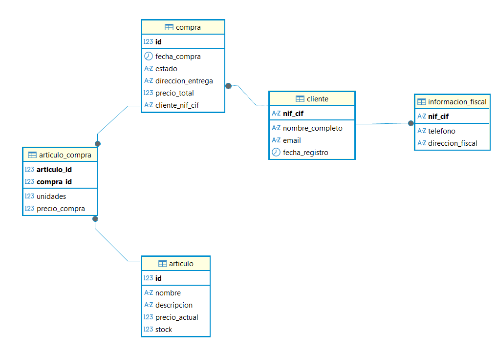

# E-Commerce Domain Model — JPA & Hibernate


A relational domain model for a basic e-commerce platform, built with **Jakarta Persistence API 3.2** and **Hibernate ORM 7**, backed by **MariaDB**.

The focus of the project is on correct JPA mapping: entity design, relationship ownership, cascade behaviour, and loading strategy. A test runner class (`AppEcommerce.java`) exercises the full CRUD lifecycle directly through the `EntityManager` API.

## Domain model



| Entity | Description |
|---|---|
| `Cliente` | Registered customer. NIF/CIF is the natural primary key. |
| `InformacionFiscal` | Billing information. One-to-one with `Cliente`, shares its primary key via `@MapsId`. |
| `Compra` | Purchase order header. Many-to-one with `Cliente`. |
| `Articulo` | Product in the catalog. |
| `ArticuloCompra` | Junction entity between `Compra` and `Articulo`. Holds quantity and the unit price frozen at the moment of purchase. |

## Key design decisions

**Shared primary key (1:1 relationship)**
`InformacionFiscal` uses `@MapsId` to share `Cliente`'s PK rather than adding a redundant foreign key column. The relationship is annotated with `CascadeType.ALL` so that fiscal data is automatically removed when its customer is deleted — fiscal records have no independent lifecycle.

**Junction entity with composite key (N:M relationship)**
`ArticuloCompra` is modelled as a full entity with an `@EmbeddedId` (`ArticuloCompraId`) instead of a plain join table. This is necessary because the table carries its own data: the quantity purchased and, crucially, the **unit price at the time of the transaction**. Since catalog prices can change, the price must be captured and frozen on the line item itself, decoupled from `Articulo.precioActual`.

**LAZY loading by default**
All associations use `FetchType.LAZY`. No data is fetched unless explicitly accessed, avoiding the N+1 and over-fetching problems that come with eager defaults.

**Targeted cascades**
Cascades are applied only where the parent–child lifecycle warrants it. `Compra` rows are intentionally preserved when a `Cliente` is deleted (the FK is nullable), reflecting a real billing requirement: purchase history must survive customer deletion.

## Running the project

### 1. Start MariaDB

```bash
docker compose up -d
```

### 2. Create the DB user and grant permissions

```bash
docker exec -i my_eshop_mariadb mariadb -uroot -pAbcd1234 < my_eshop_db_script.sql
```

### 3. Create tables and load sample data

```bash
docker exec -i my_eshop_mariadb mariadb -uroot -pAbcd1234 < my_eshop_table_script.sql
```

### 4. Build and run

```bash
mvn compile exec:java -Dexec.mainClass="com.silviarafa.ecommerce.ecommerceProject.AppEcommerce"
```

The default Maven profile is `dev` (localhost, port 3310). Profiles `pre` and `pro` are also available via `-P pre` / `-P pro`.

`AppEcommerce.java` runs a full CRUD sequence: creates a customer with billing info, adds a product, places an order with multiple line items, updates records, and deletes them — all with explicit transaction management and rollback on error.

## Authors

Silvia Balmaseda Hernández · Rafael Robles García  
DAM — Desarrollo de Aplicaciones Multiplataforma, 2025
